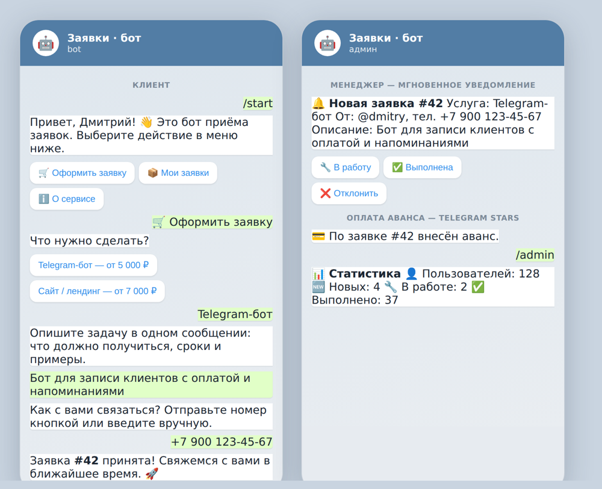

# 🤖 Telegram-бот приёма заявок — с оплатой и админ-панелью

Бот для приёма заказов/заявок в Telegram: клиент выбирает услугу, описывает
задачу, оставляет телефон — менеджер мгновенно получает уведомление и управляет
заявкой прямо из Telegram. Опционально — приём аванса через Telegram Stars.

> **🚀 Живое демо: [@slaker_orders_bot](https://t.me/slaker_orders_bot)** — напишите
> `/start` и пройдите сценарий; оплату аванса можно попробовать за 1 ⭐, звезда вернётся.

## Стек

- **Python 3.10+**, **aiogram 3** (FSM, inline/reply-клавиатуры)
- **SQLite** (aiosqlite) — пользователи и заявки
- **Telegram Stars / Payments** — приём аванса
- **Docker** / docker-compose, systemd

## Скриншот

Слева — сценарий клиента, справа — что видит менеджер:



## Возможности

**Для клиента:**
- 🛒 Оформление заявки за 4 шага: услуга → описание → телефон → подтверждение (FSM)
- 💳 Оплата аванса прямо в чате: Telegram Stars (без настройки, в демо звёзды возвращаются)
- 📦 «Мои заявки» — список своих заявок со статусами

**Для администратора:**
- 📋 Панель `/admin`: заявки с кнопками «В работу / Выполнена / Отклонить»
- 🔔 Мгновенное уведомление о каждой новой заявке и внесённом авансе
- 📊 Статистика по пользователям и заявкам
- 📣 Рассылка по всем пользователям бота

## Запуск

```bash
cp .env.example .env      # впишите BOT_TOKEN (от @BotFather) и ADMIN_IDS
docker compose up -d --build
```

Оплата по умолчанию — через **Telegram Stars**, настраивать эквайринг не нужно.
Все параметры (Stars/рубли, суммы, админы) — в `.env.example`. Каталог услуг и
цены — в словаре `SERVICES` в [`app/config.py`](app/config.py).

## Структура

```
app/
├── main.py       # точка входа: конфиг, БД, роутеры, polling
├── config.py     # переменные окружения + каталог услуг
├── db.py         # SQLite: пользователи и заявки
├── keyboards.py  # все клавиатуры
└── handlers/     # user.py (заявка, оплата) · admin.py (панель, статистика, рассылка)
```

## Под вашу задачу

Каталог, тексты и сценарий легко меняются под конкретный бизнес — запись клиентов,
магазин, доставка, поддержка, интеграция с CRM или Google Sheets.
Нужен такой бот? Пишите: [github.com/slakertop1](https://github.com/slakertop1)

## Лицензия

MIT — см. [LICENSE](LICENSE).
